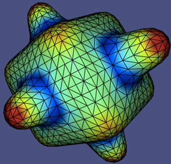
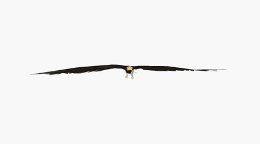
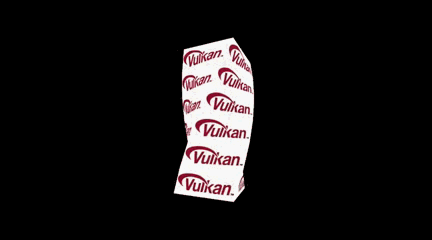
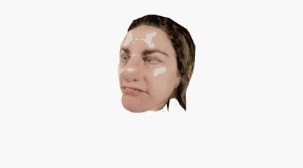
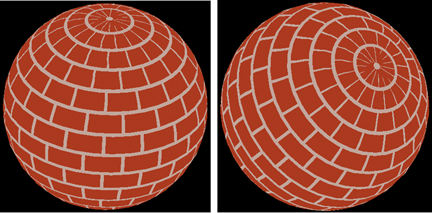
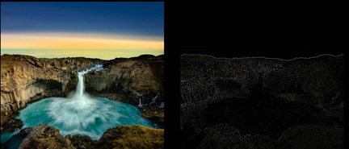
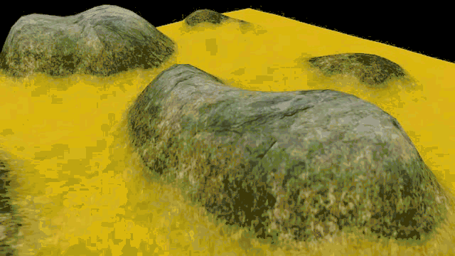
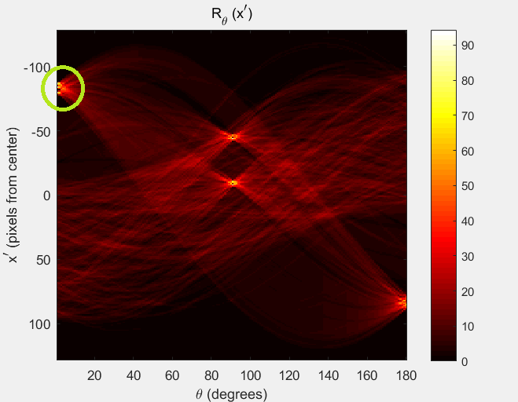

# 图形、图像处理技术笔记

本人目前在在[人工智能与三维可视化实验室](http://www.ustb-ai3d.cn/index)做计算机图形学相关工作。此记录个人学习过程中的遇到的问题和知识点的总结，包括图形学，图像处理，C++等领域。:smile_cat: :smile_cat: :smile_cat:，同时也可能会不定期分享一些好文章。

如果写的内容对您有帮助，或者帮您解决了棘手的问题，还希望您能点击一下右上角的``Star⭐️``，您的Star代表了一种认可，我才会更有动力坚持下去~~~万分感谢。

当然，您有什么问题和意见都可以联系我，我的联系方式是[邮箱：yindou97@163.com](mailto:yindou97@163.com)。我的知乎：[知乎地址](https://zhuanlan.zhihu.com/graphics-douysu) 我的博客：[博客地址](https://blog.csdn.net/ModestBean)。我的更多信息请查看我的[简历](https://douysu.github.io/images/cv-dou.pdf)。

``重要：当您发现我所写的内容存在不合理的地方时，请您尽快联系我，因为在我眼里，误导他人是一件非常严重的事情。感谢~``

## 技术交流群

加入微信群比较好，微信大家使用较多~

 
  
 

# 目录
- [3D，OpenGL，图形学](#3dopengl%E5%9B%BE%E5%BD%A2%E5%AD%A6)
- [Shader着色器](#shader%E7%9D%80%E8%89%B2%E5%99%A8)
- [图像处理](#%E5%9B%BE%E5%83%8F%E5%A4%84%E7%90%86)
- [C++](#c)
- [算法](#%E7%AE%97%E6%B3%95)

## 3D，OpenGL，图形学

对应文章博客 | 源代码位置 | 效果 |
:-:|:-:|:-:|
[Physically Based Rendering-IBL（PBR基于物理渲染）](https://zhuanlan.zhihu.com/p/176474625) | [源代码位置](https://github.com/douysu/graphics-algorithm/tree/master/physically-rendering)| 
  [[演示视频]](https://www.bilibili.com/video/BV1TV411z7qe)|
[Ray Tracing（光线追踪）](https://zhuanlan.zhihu.com/p/144189898) | [源代码位置](https://github.com/douysu/graphics-algorithm/tree/master/tinyraytracerYD)| 
 |
[Software Rendering（软渲染）](https://zhuanlan.zhihu.com/p/128112217) | [源代码位置](https://github.com/douysu/graphics-algorithm/tree/master/tinyrendererYD)| 
 |
[Fluid Simulation（物理动画流体模拟）](https://zhuanlan.zhihu.com/p/161808444) | [源代码位置](https://github.com/douysu/graphics-algorithm/tree/master/melt-animation)| 
 |
[3D Curvature（3D曲率原理及计算）](https://blog.csdn.net/ModestBean/article/details/89438082) | [源代码位置](https://github.com/douysu/graphics-algorithm/tree/master/3D-PLY)| 
 |
[3D Skeleton Analysis（3D模型骨架提取及分析）](https://blog.csdn.net/ModestBean/article/details/89632272) | [源代码位置](https://github.com/douysu/graphics-algorithm/tree/master/3D-skeleton) | 
 |
[3D Medical Body（医疗项目3D人体展示系统）](https://blog.csdn.net/ModestBean/article/details/79241519) | [源代码位置](https://github.com/douysu/graphics-algorithm/tree/master/moving-light-strip) | 

 |
[OpenGL MotionStreak（OpenGL拖尾、刀光、剑光、尾焰效果）](https://blog.csdn.net/ModestBean/article/details/79245439) | [源代码位置](https://github.com/douysu/graphics-algorithm/tree/master/streak) | 

 | 
3D Aquarium（基于物理粒子系统的鱼群水族馆）| [源代码位置](https://github.com/douysu/graphics-algorithm/tree/master/wallpaper) | 

 |
[3D Scene Blur（OpenGL场景Blur虚化景深效果）](https://blog.csdn.net/ModestBean/article/details/79512208) | [源代码位置](https://github.com/douysu/graphics-algorithm/tree/master/blur-scene-gaussian--3d) |  |
Multi-buffer X-Ray（多缓冲X-Ray人物透视效果）| [源代码位置](https://github.com/douysu/graphics-algorithm/tree/master/x-ray-scene_3d) |  |
[OpenGL Camera（OpenGL 摄像机漫游）](https://blog.csdn.net/ModestBean/article/details/79130876) | [源代码位置](https://github.com/douysu/graphics-algorithm/tree/master/CameraRoam) |  |
[OpenGL Uniform Buffer Object（Uniform缓冲对象）](https://blog.csdn.net/ModestBean/article/details/79130517)  | [源代码位置](https://github.com/douysu/graphics-algorithm/tree/master/opengles-uniform-buffer) | 

 |

## Shader着色器

内容 | 源代码位置 | 效果 |
:-:|:-:|:-:|
[关键帧动画效果顶点着色器的实现](https://blog.csdn.net/ModestBean/article/details/79152173)| [源代码位置](https://github.com/douysu/shader) |  |
[树干弯曲顶点着色器实现](https://blog.csdn.net/ModestBean/article/details/79151382) | [源代码位置](https://github.com/douysu/shader) |  |
[旋转扭动效果顶点着色器实现](https://blog.csdn.net/ModestBean/article/details/79141241) | [源代码位置](https://github.com/douysu/shader) | |
[波动效果顶点着色器的实现](https://blog.csdn.net/ModestBean/article/details/79139315) | [源代码位置](https://github.com/douysu/shader) |   |
[扭曲效果顶点着色器的实现](https://blog.csdn.net/ModestBean/article/details/79171289) | [源代码位置](https://github.com/douysu/shader) |  |
[膨胀效果顶点着色器的实现](https://blog.csdn.net/ModestBean/article/details/79171410) | [源代码位置](https://github.com/douysu/shader) |  |
[砖头墙壁纹理片元着色器实现](https://blog.csdn.net/ModestBean/article/details/79187023) | [源代码位置](https://github.com/douysu/shader) |  |
[着色器滤镜、图像卷积与滤波、数字图像处理](https://blog.csdn.net/ModestBean/article/details/79192901)| [源代码位置](https://github.com/douysu/shader) |  |
[体积雾特效的使用](https://blog.csdn.net/ModestBean/article/details/79251244)| [源代码位置](https://github.com/douysu/shader) |  |

## 图像处理

内容 | 源代码位置 | 效果 |
:-:|:-:|:-:|
[radon直线检测及绘制直线](https://blog.csdn.net/ModestBean/article/details/89632272) | [源代码位置](https://github.com/douysu/algorithm/tree/master/image-processing) |  |

## C++

内容 | 源代码位置 |  
:-:|:-:|
[C++ 高级数据类型枚举Enum](https://blog.csdn.net/ModestBean/article/details/79173704) | [源代码位置](https://github.com/douysu/c-code) |
[C++ 函数内联inline](https://blog.csdn.net/ModestBean/article/details/79178943) | [源代码位置](https://github.com/douysu/c-code) | 
[C++ 泛型编程—Template模板](https://blog.csdn.net/ModestBean/article/details/79562998) | [源代码位置](https://github.com/douysu/c-code) |
[C++ 复数类complex解析](https://blog.csdn.net/ModestBean/article/details/79592468) | [源代码位置](https://github.com/douysu/c-code) |
[C++ 常量总结-const](https://blog.csdn.net/ModestBean/article/details/84995798) | [源代码位置](https://github.com/douysu/c-code) |
[C++ const常用用法-提高程序的健壮性](https://blog.csdn.net/ModestBean/article/details/85007434) | [源代码位置](https://github.com/douysu/c-code) | 
[C++ 内存管理——堆（stack）栈（heap）](https://blog.csdn.net/ModestBean/article/details/85258980) | [源代码位置](https://github.com/douysu/c-code) |
[C++ 内存管理——常见的内存错误及对策](https://blog.csdn.net/ModestBean/article/details/85344851)| [源代码位置](https://github.com/douysu/c-code) |
[C++ 内存管理——指针参数传递内存](https://blog.csdn.net/ModestBean/article/details/85375163) | [源代码位置](https://github.com/douysu/c-code) |
[C++ 实践细节总结](https://blog.csdn.net/ModestBean/article/details/86481072) | [源代码位置](https://github.com/douysu/c-code) |
[C++ 线程的基本使用方式](https://blog.csdn.net/ModestBean/article/details/90272892) | [源代码位置](https://github.com/douysu/c-code) |
[C++ 拷贝函数C++标准库复数类string解析](https://blog.csdn.net/ModestBean/article/details/90273092) | [源代码位置](https://github.com/douysu/c-code) |

## 算法

内容 | 源代码位置 |  
:-:|:-:|
[ACO蚂蚁寻路最短路径TSP问题](https://blog.csdn.net/ModestBean/article/details/101852092)| [源代码位置](https://github.com/douysu/algorithm/tree/master/ACO_aunt_optimal_path) |
